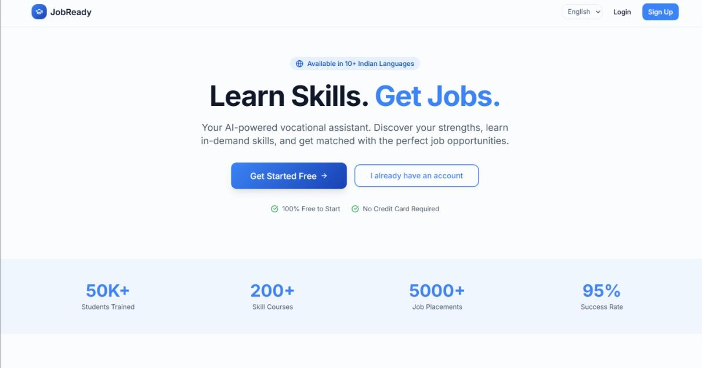
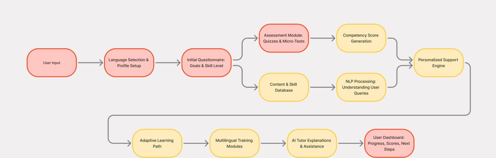
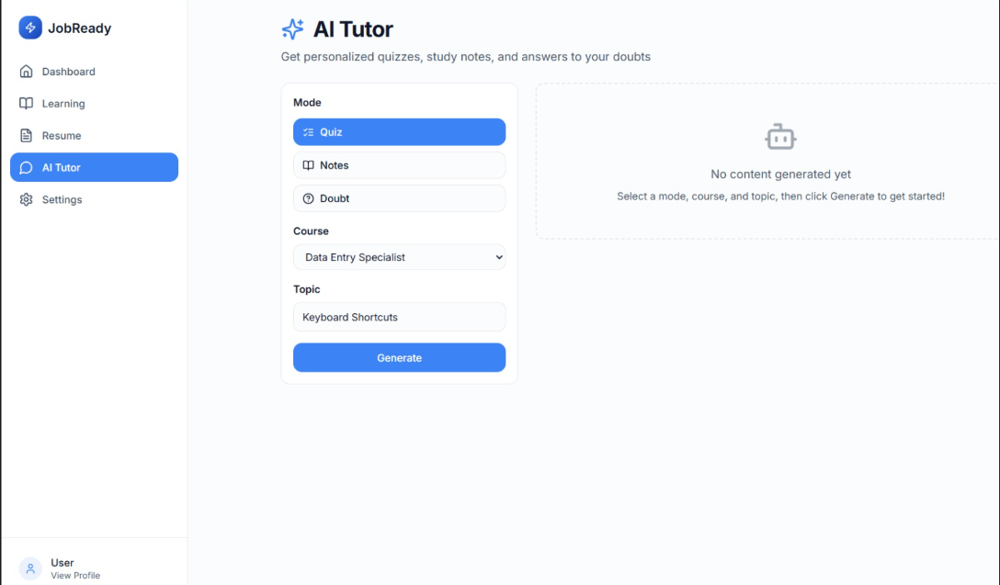
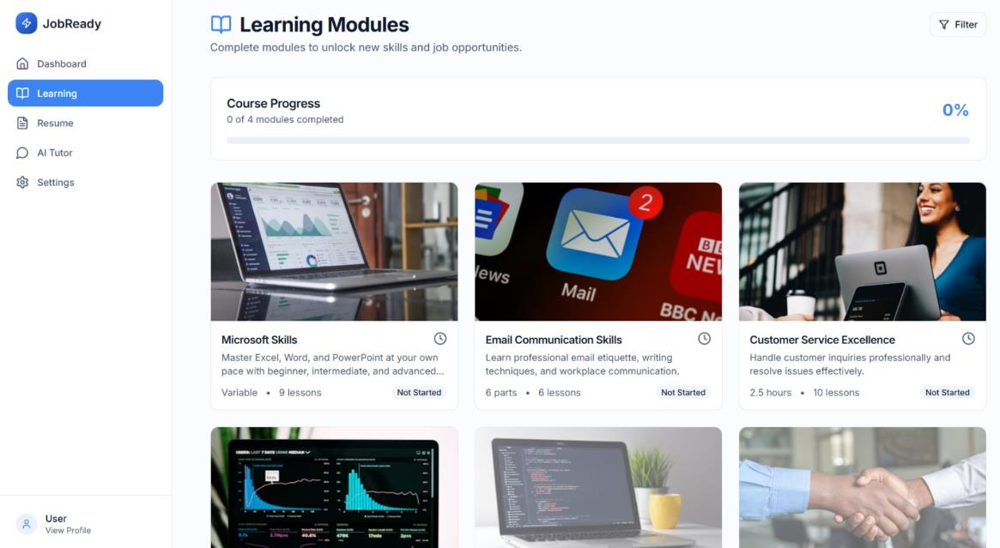
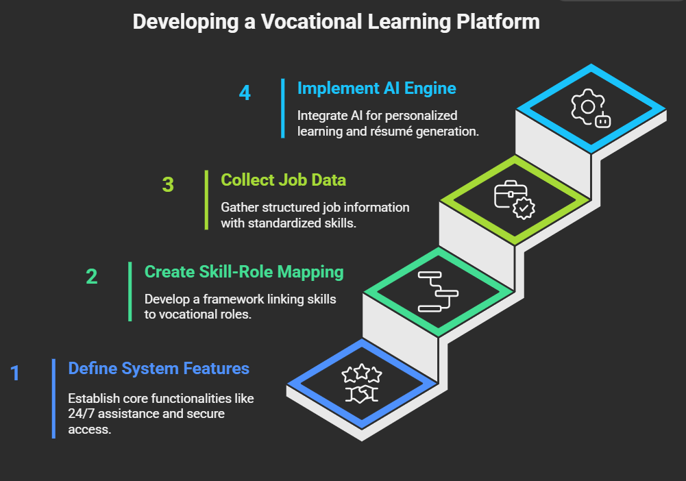

# JobReady - E-Learning Platform for Vocational Training

An AI-powered vocational training platform that personalizes skill-based
learning: learners onboard in their preferred language, get assessed
through quizzes and micro-tests, receive a competency score, and follow
an adaptive learning path with an AI tutor available for instant help.

Experiential Learning Project (SDG-9: Industry, Innovation and
Infrastructure) - Department of CSE, RV College of Engineering, 2025-26.



---

## The problem

Vocational learners - students, job seekers, and working professionals -
often face one-size-fits-all training: everyone gets the same content
regardless of skill level, learning speed, or goals. Progress is hard to
track, guidance is limited, and language is a barrier for many learners.

JobReady addresses this with an intelligent training loop: understand the
learner first, assess continuously, and adapt the training path to their
performance.

## How it works



1. **User input + language selection + profile setup** - learners onboard
   in their preferred language (10+ Indian languages supported)
2. **Initial questionnaire** - captures goals and current skill level to
   pick the right starting point
3. **Assessment module** - quizzes and micro-tests at regular intervals,
   scored automatically
4. **Competency score generation** - a live score reflecting the
   learner's performance, updated after every assessment
5. **Content & skill database** - structured storage of training modules,
   lessons, practice material, and quiz questions
6. **NLP query understanding** - learner doubts asked in natural language
   are interpreted and mapped to the right topic
7. **Personalized support engine** - combines profile + competency score
   + query analysis to recommend the right modules and next steps
8. **Adaptive learning path** - high performers advance to harder
   modules; struggling learners get revision and extra practice
9. **AI tutor** - instant explanations, generated quizzes, study notes,
   and doubt resolution (Gemini-powered)
10. **Dashboard** - progress, competency scores, completed modules, and
    recommended next steps

## Screenshots

### AI Tutor - personalized quizzes, notes, and doubt solving


### Learning Modules - skill courses with progress tracking


## Tech stack

| Layer | Technology |
|:------|:-----------|
| Frontend | React + TypeScript, Vite, Tailwind CSS, react-i18next (en/hi/kn locales) |
| Backend | Node.js + Express (ES modules), JWT auth middleware |
| Databases | PostgreSQL (Supabase) + MongoDB |
| AI | Gemini API (AI tutor: quiz/notes/doubt generation), NLP query understanding |
| Auth | Email OTP (Supabase) + JWT sessions |

## Running locally

```
# Backend
cd backend
npm install
cp .env.example .env    # fill in your own values
npm start               # runs on port 5000

# Frontend
cd frontend
npm install
npm run dev             # runs on port 8080
```

See `backend/START_HERE.md` and `STARTUP_FIXES.md` for detailed setup
notes and troubleshooting.

## Development approach



The platform was built module-by-module following a competency-based
learning model: user profiling (profile + questionnaire), continuous
assessment with competency scoring, an adaptive learning framework, and
AI/NLP-assisted personalization - then integrated and tested end-to-end
(onboarding, assessments, scoring, recommendations, dashboard).

## Team

| Name | USN | Role |
|:-----|:----|:-----|
| Vaanya Singh | 1RV23CS277 | |
| Manya Sharma | 1RV23AI053 | |
| Aryaki | 1RV23CS050 | |
| Kavya | 1RV23CY025 | Database design (PostgreSQL/Supabase), email OTP authentication |
| Anish | 1RV23CS039 | |

**Mentor:** Dr. Vinay Hegde, Professor, Dept. of CSE, RVCE.

This copy of the repository is maintained by Kavya.
